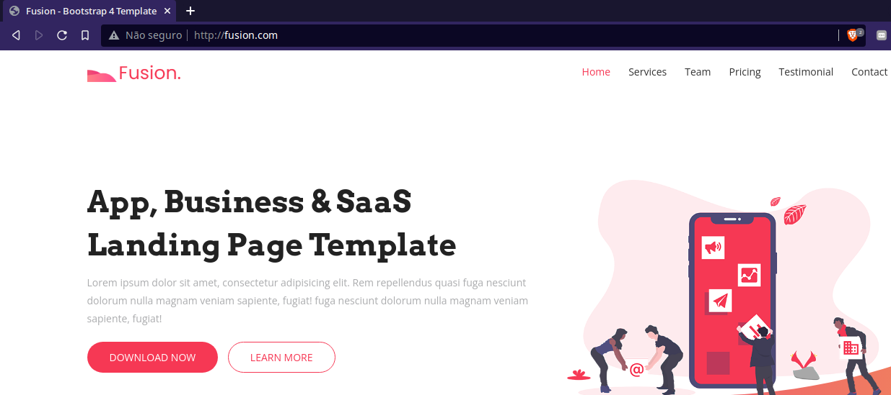
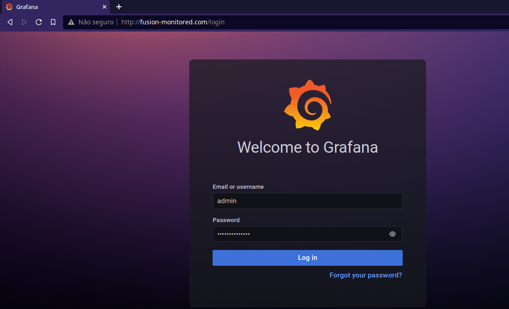
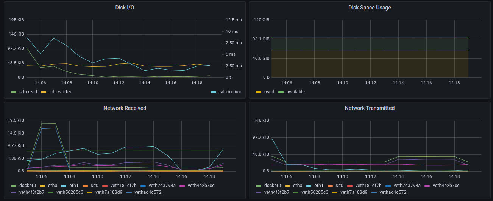
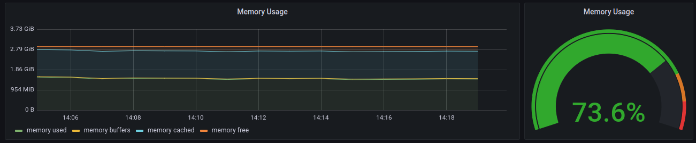
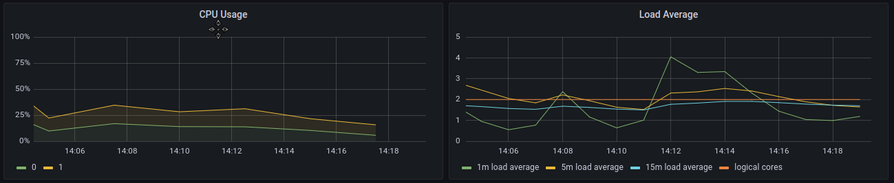

# DevOps to Automate the Deployment of Web Pages with Prometheus

## Objectives
- Serve a static website on a Kubernetes cluster.
- The container that provides the website must be continuously monitored.
- For each commit in the website's repository, automatically a new image is built and pushed to DockerHub, then a container with this latest image should be deployed replacing the container with the old website on the cluster.

## Implementation

A CentOS machine with Jenkins and Ansible configures a Kubernetes Cluster to run the latest version of the website in a Nginx container monitored by Prometheus. The Bitnami's Nginx Helm Chart was used, so we can make use of its exporter (needed for Prometheus).

    
  
  
  
  

Obs: It was necessary to create a task in the playbook to delete the old nginx helm chart because the force option (force reinstall) presented some issues.

## Usage
- Jenkins needs to be configured to access: 
1) Your GitHub Repository
2) Your Docker Hub
3) The Kubernetes Cluster Machine
- After the first commit to the repository, it's necessary to do a manual Scan on Jenkins so it can obtain the configuration files and perform the build. Subsequent commits will be automatically recognized by Jenkins.

## Result

  

  

  

  

  

- The static website is available at:
https://onepagelove.com/fusion-lite